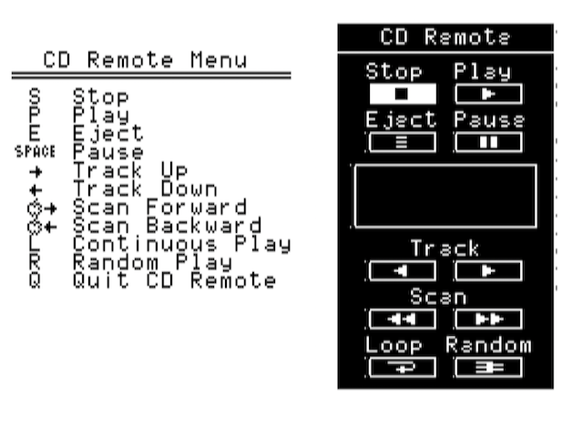

# Disassembly of CDREMOTE.OBJ from the Apple II CD-ROM Explorer

Apple's release of the AppleCD SC in 1988 was accompanied by supporting software for the Macintosh, the 16-bit Apple IIgs, and the 8-bit Apple IIe. This software included a "remote" for controlling audio CD playback from the computer.

Disk image: [Apple II CD Setup.dsk](https://www.apple.asimov.net/images/hardware/storage/disk/misc/Apple%20II%20CD%20Setup.dsk)

In the case of the Apple IIe software, it was a stand-alone ProDOS-8 program controlled using keyboard commands.

## Demo

By Cloudschatze:

## This Repo

Since the specifics of controlling the CD player from ProDOS-8 are not documented, we worked to disassemble the CDREMOTE.OBJ file in order to document it and enable the development of other programs to control it.

The included source builds a byte-identical copy to the original when using the ca65 assembler.
